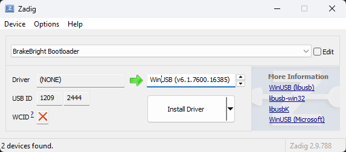
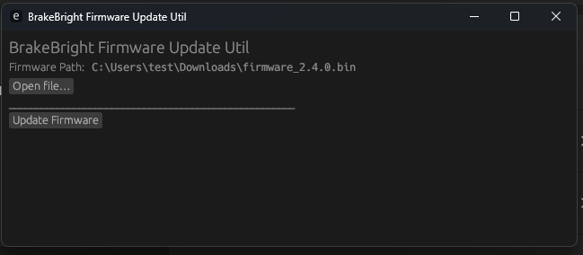

# bikesafe-util

## Utility software for [BrakeBright](https://shop.bikesafe.me)

A cross-platform firmware flashing utility for the Bikesafe DFU bootloader. Written in Rust with a GUI frontend (egui) and a CLI backend, this tool allows you to safely verify and download firmware images to your device via the USB DFU protocol.

## Features

- **Cross-platform**: Windows & Linux support via `rusb` + WinUSB/libusb
- **GUI & CLI**: egui-based desktop app plus a command-line interface
- **Firmware validation**: file-size, vector-table, and embedded magic-key checks
- **Progress reporting**: real-time progress bar, both in terminal and GUI

## Installation

### Linux

1. Build or download the latest release from the [GitHub Releases](https://github.com/mygnu/bikesafe-util/releases).
2. **Create a udev rule** so non-root users can access the DFU interface:

   Save the following to `/etc/udev/rules.d/70-bootloader.rules`:

   ```ini
   ATTRS{idVendor}=="1209", ATTRS{idProduct}=="2444", TAG+="uaccess"
   ```

3. Reload udev rules and trigger:

   ```bash
   sudo udevadm control --reload && sudo udevadm trigger
   ```

4. Plug in your device (see “Entering DFU Mode” below).

### Windows

1. Download and run [Zadig](https://zadig.akeo.ie/).
2. Plug in your DFU device (see “Entering DFU Mode”), then in Zadig:

   - Select **List All Devices** if necessary
   - Choose `BrakeBright Bootloader` with USB ID `1209:2444`
   - Select **WinUSB** (or **libusbK**) as the driver
   - Click **Install Driver**

   

3. Download the latest Bikesafe Utility `.zip` from the [Releases](https://github.com/mygnu/bikesafe-util/releases) page and extract.

## Entering DFU Mode

1. Remove the device from the motorcycle (or use a laptop).
2. Connect via the USB-C port.
3. Watch the **white/yellow LED** — when it’s on, press the **boot button**.
4. The **red LED** will start blinking periodically. This indicates DFU mode is active and the device is ready to receive firmware.

## Usage

### GUI

1. Launch the `bikesafe-util` executable.
2. In the file picker, select `firmware.bin`.
3. Click **Update Firmware**.
4. Monitor the progress bar.
5. On success, the device will auto-exit DFU mode.



### CLI

```bash
# Show help
bikesafe-util --help

# Flash firmware via CLI
bikesafe-util \
  --device 1209:2444 \
  --path firmware.bin \
  --reset
```

- `--device` (`-d`): Vendor\:Product ID
- `--path` (`-p`): path to `.bin` file
- `--reset` (`-r`): issue a detach/reset after download

## Post-Flash Test

After a successful flash, the device will exit DFU mode automatically. To verify operation:

1. Tilt the device **forward** in the direction of the arrow printed on it to simulate deceleration.
2. The red light should illuminate in a pattern resembling a brake-light signal.

## Contributing

Pull requests, issues, and feature requests are welcome. Please follow the [Rust API style guidelines](https://github.com/rust-lang/api-guidelines) and ensure CI passes.

## License

This project is licensed under the **GPLv3** license.
